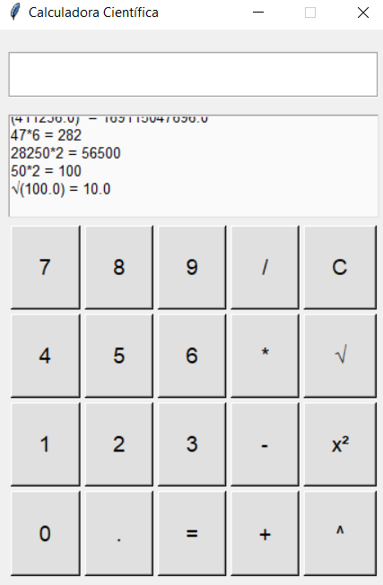

# 🧮 Calculadora Científica em Tkinter

## 📌 Descrição
Esta é uma calculadora científica desenvolvida em Python usando a biblioteca Tkinter. Ela suporta operações matemáticas básicas, como adição ➕, subtração ➖, multiplicação ✖️ e divisão ➗, além de funcionalidades adicionais como raiz quadrada √ e potência 🔢.

## ✨ Funcionalidades
- 🎨 **Interface intuitiva** com botões numerados e operadores matemáticos.
- 🔢 **Campo de entrada** para expressões matemáticas.
- 📜 **Exibição de histórico** de cálculos.
- ⌨️ **Suporte a teclas do teclado** para entrada rápida.
- 🏆 **Operações avançadas**: raiz quadrada (√), exponenciação (^), quadrado (x²).

## 📋 Requisitos
- 🐍 **Python 3.x**
- 📦 **Tkinter** (incluído por padrão em instalações do Python)

## ▶️ Como executar
1. ⬇️ Clone este repositório ou copie o arquivo Python.
2. ▶️ Execute o script com o seguinte comando:
   ```bash
   python calculadora.py
   ```

## 🎯 Uso
- 🖱️ Utilize os botões na interface para inserir números e operadores.
- ✅ Pressione `=` para calcular a expressão.
- ❌ Use `C` para limpar a entrada.
- ⏎ Pressione `Enter` para calcular ou `Esc` para limpar.

## 🖼️ Captura de Tela


## 👨‍💻 Autor
Desenvolvido por João Victor Ferrari de Melo

## 📜 Licença
Este projeto está licenciado sob a **MIT License** - veja o arquivo LICENSE para mais detalhes.

